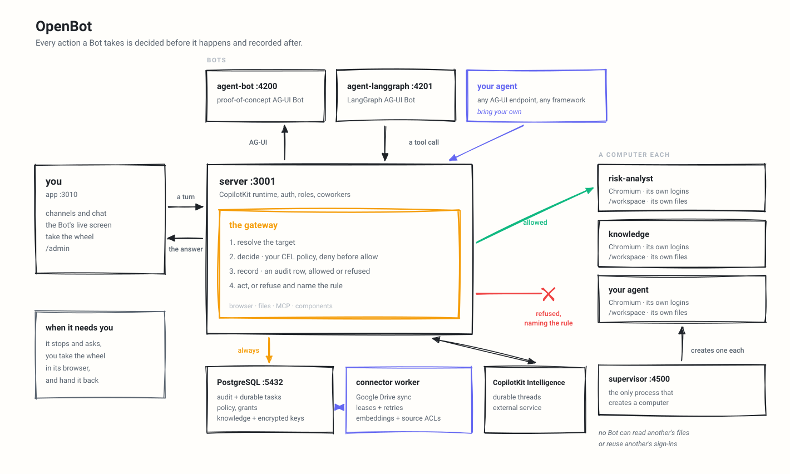

# Architecture

OpenBot combines a React app, a Hono API server, PostgreSQL, CopilotKit Intelligence, AG-UI Bot endpoints, and governed browser computers.

<picture>
  <source media="(prefers-color-scheme: dark)" srcset="../assets/architecture-dark.svg">
  
</picture>

Regenerate it with `bun run diagram` after changing anything it shows.

## Services and ports

| Component                | Port                       | Responsibility                                                                                                                              |
| ------------------------ | -------------------------- | ------------------------------------------------------------------------------------------------------------------------------------------- |
| `app`                    | 3010                       | React/Vite interface for channels, Bot chat, the work control center, live screen, settings, and admin pages.                               |
| `server`                 | 3001                       | API, CopilotKit runtime, auth, roles, tenant package, coworkers, channels, durable work, policy, audit, credentials, plugins, components, and connectors. |
| `connector-worker`       | internal                   | Leases connector jobs, syncs Google Drive, creates embeddings, persists ACLs and chunks, and retries failed syncs.                         |
| `agent-computer`         | 4100                       | Chromium, `/workspace`, browser profile, screenshots, snapshots, and file tools.                                                            |
| `agent-bot`              | 4200                       | Proof-of-concept AG-UI Bot.                                                                                                                     |
| `agent-langgraph`        | 4201                       | LangGraph AG-UI Bot.                                                                                                                        |
| `supervisor`             | 4500 host / 4300 container | Creates, stops, resets, and lists per-Bot computer containers.                                                                              |
| PostgreSQL with pgvector | 5432                       | Product data, audit rows, credentials, policy, grants, channels, projects, routines, handoffs, inspectable memory, components, connector state, and knowledge records. |
| CopilotKit Intelligence  | external                   | Durable conversation threads and realtime gateway.                                                                                          |

`scripts/start.sh` starts PostgreSQL, the connector worker, `agent-computer`, `agent-bot`, `agent-langgraph`, and the supervisor through Docker Compose, then starts `server` and `app` on the host.

The compose file also defines optional SPIRE services. `start.sh` does not start them.

## Runtime flow

1. The app opens a channel or direct Bot session.
2. The server resolves the signed-in actor and selected coworker.
3. The server loads the MCP tools granted to that named coworker and adds their descriptions to the run.
4. CopilotKit runtime sends the turn to the configured AG-UI endpoint. Remote coworkers also receive a short-lived, signed assertion tying the run to the coworker, signed-in actor, and durable channel task when one opened the turn.
5. The surface registers only tools that must run in the browser, such as computer controls and components.
6. Built-in coworkers execute MCP calls directly on the server. Remote coworkers call the server back with their per-coworker token and signed run assertion.
7. Every coworker receives the same server-side knowledge-search tool. Retrieval combines lexical and vector rank, applies connector ACL allow/deny rules in SQL for the signed-in actor, and returns citations rather than raw connector credentials.
8. Browser, file, and MCP actions pass through the same authorization, policy, approval, and audit boundaries before the server streams results back to the app and Intelligence thread. A server-side MCP call that needs approval waits on its validated durable task and retries once with the exact approved request.

## Browser action governance

The computer itself does not decide policy. The server gateway is the action boundary:

1. resolve the target from the server-held snapshot or request subject;
2. evaluate the current action policy;
3. write an audit row for the decision;
4. call the computer only when the decision forwards;
5. write a second audit row if a forwarded action fails.

Policy rules can inspect:

- `tool.name`
- `intent`
- `bot.id`
- `actor.id`
- `page.url`, `page.host`
- `element.ref`, `element.role`, `element.name`, `element.type`
- `key`
- `file.path`, `file.name`, `file.extension`
- `mcp.server`, `mcp.tool`, `mcp.effect`

Rules use CEL expressions plus case-insensitive `contains()` and `matches()`.
Deny rules are evaluated before allow rules. The policy engine fails closed: a
missing or empty policy permits nothing, a broken deny rule denies, and a broken
allow rule does not permit. OpenBot's shipped startup default is explicit:
`deny: []` and `allow: ["true"]`, unless `AGENT_COMPUTER_POLICY` or a saved
administrator policy replaces it. A malformed configured policy stops server
startup.

## Computers

`agent-computer` requires `COMPUTER_TOKEN` and permits only `/health` without it. Docker Compose binds it to `127.0.0.1:4100`.

With `COMPUTER_SUPERVISOR_URL`, each Bot gets its own computer container, workspace volume, and browser profile. Without it, all Bots share `AGENT_COMPUTER_URL`.

The supervisor exposes only ensure, stop, reset, and list operations. It holds the Docker socket, so do not expose it outside the deployment network. Set `COMPUTER_RUNTIME=runsc` to run computers under gVisor on hosts that support it.

The server leases a supervisor-reported computer address for one minute and deduplicates concurrent
cold starts. Stop and reset invalidate the lease immediately. Opening the screen also warms the
persistent Chromium profile so the first visible action is not forced to pay both container and
browser startup costs.

Browser actions return a compact observation with page text, fresh actionable refs, and a small
change summary. This lets the next decision continue from the action response instead of spending
separate model turns on `read` and `snapshot`; full reads and 200-control snapshots remain explicit
fallbacks for long pages. Each server-to-computer call emits structured `computer-timing` phase data
for location, transport, and total duration.

The watch panel uses one shared WebSocket per Bot. Chrome pushes JPEG frames only when the page
changes, and that same connection carries page metadata, control handovers, action highlights, and
human input. Inline and full-screen views share the connection and its latest frame, so historical
tool rows do not poll or accumulate copies of the current screenshot. Background media is skipped
while nobody is watching and allowed while a live viewer is attached.

## Human control and secrets

Handovers are audited as control events:

- `computer.help_requested`
- `computer.control_taken`
- `computer.control_released`

While a person controls the browser, Bot actions are refused rather than queued.

Secret entry is separate from chat content. The audit trail records that a secret was requested or supplied and the character count, not the secret value.

During takeover, keyboard focus stays on the remote canvas, paste is inserted directly into the
page, and a selected file (up to 10 MB) is sent directly to the focused file input. Pasted text and
uploaded file contents are not exposed to the model or written to the conversation.

## Coworkers, channels, and durable work

A coworker is a durable Bot profile:

- `agents` stores runtime identity and endpoint/key reference.
- `agent_profiles` stores name, title, role, owner, visibility, and deletion state.
- `agent_preferences` stores per-user roster state.

A channel is a conversation with one or more coworkers and one CopilotKit
Intelligence thread mapping. A team channel always has an explicit active
coworker; that coworker alone answers the next turn, while the shared transcript
keeps the handoff legible. Starting a new channel creates a new thread. Each
coworker continues to use its own computer, browser profile, workspace, and
granted tools.

Conversation text remains in CopilotKit Intelligence. PostgreSQL stores only
Kayco-owned conversation metadata: `message_reactions` keeps channel-scoped
emoji acknowledgements by opaque message id, and `codex_user_preferences`
keeps each person's optional built-in model and reasoning choices. Membership
is checked before reaction reads and writes. Unsent draft text is browser-local;
attachments are deliberately not placed in browser storage.

Team template import is a separate trust boundary. The parser allowlists only
persona fields, creates fresh private coworkers on the managed endpoint in one
transaction, and excludes credentials, grants, runtime configuration, and
conversation data.

The `/work` surface is backed by deployment-owned PostgreSQL records:

- `task_runs` and `task_run_events` record durable attempts and lifecycle transitions;
- `routines` and `routine_dispatches` create idempotent manual, scheduled, or authenticated-webhook work;
- `projects`, members, assigned agents, and versioned artifacts hold explicitly shared project context;
- `delegations` and delegation messages make user-to-Bot and Bot-to-Bot handoffs durable and attributable;
- `memory_entries` stores inspectable user, coworker, or project memory with source, confidence, and pinning;
- `notifications` surfaces scheduled work and handoff outcomes to the owning user.

The routine scheduler claims due rows with database locks, advances the next
occurrence before dispatch, and reserves a unique routine/time pair. Webhook
tokens are shown once and only a cryptographic hash is stored. Starting queued
routine or delegation work reuses the reserved task run rather than creating a
second attempt.

A background executor leases those queued runs with row locks, heartbeats while
they execute, and recovers expired leases after a process dies. Attempts have a
bounded runtime, exponential retry scheduling, durable output, and a maximum
attempt count. Routine and delegation status, notifications, and audit events
are settled from the same terminal result so the UI cannot claim success before
the actual Bot run succeeds.

Relevant user and coworker memory is supplied to a conversation as system
context and can also be recalled explicitly through a Bot tool. The memory UI
remains the source of truth: people can inspect, pin, edit, or remove entries.
Secrets and transient chat text are explicitly excluded from the memory tool's
contract.

See [coworkers.md](coworkers.md).

## Components

Components are frontend tools a Bot can call instead of answering only in prose.

Sources:

- compiled React components in `app/src/components/gallery/`;
- sandboxed components authored and published from `/admin/playground`.

Governance:

- compiled components are published when first seen by the app catalogue sync;
- sandboxed components are saved as drafts and become usable only after publish;
- every call asks the server whether the component exists, is published, and is not withheld from the Bot;
- component data functions require a separate per-component grant.

The shipped component data functions read the audit trail: `botActivity` and `recentRefusals`.

## MCP and skills

MCP servers and skills share the plugin grant table, but they have different ownership rules.

- MCP tools are admin-governed because they can reach external systems with stored credentials.
- Skills are reusable instructions. A person can create personal skills and attach them only to Bots they own. Administrators create deployment skills.

The curated MCP catalogue contains Atlassian, Box, Slack, Salesforce, and ServiceNow. Custom MCP servers must pass URL checks; unknown tools and custom-server tools are treated as writes unless positively classified as reads. Servers can use either a write-only bearer token or standards-based OAuth with discovery, dynamic client registration, PKCE, encrypted refresh/access tokens, and a state-bound callback.

Every MCP call checks the grant first, then evaluates the same action policy engine with MCP context, then audits the result. MCP descriptions and execution now live on the server, so a coworker can use a granted MCP tool during an unattended run without an open browser tab. When a call matches an approval rule, the durable task is marked as waiting, the server waits for the person's decision, and only the fingerprinted approved request can be consumed on retry. A remote coworker authenticates that callback with a per-coworker token, and the server verifies a short-lived signed assertion before trusting the Bot, actor, task, and channel identities. Only a hash of the long-lived callback token is stored.

The versioned extension SDK packages connectors and declarative skills. External action tools remain MCP tools so extensions cannot create a second, ungoverned execution path. See [extensions.md](extensions.md).

## Tenant package and knowledge

`TENANT_PACKAGE_DIR` points at the tenant package. The default is `../examples/fintech`.

Required package files:

- `brand.yaml`
- `agents.yaml`
- `channels.yaml`
- `model.yaml`
- `knowledge.yaml`

The server validates the package at startup. Channel agent IDs must match declared agents. Knowledge source declarations support Google Drive and Microsoft OneDrive; the installed worker currently implements Google Drive. Administrators configure domain-wide delegation and queue an immediate sync from `/admin/connectors`.

Connector credentials are stored through the credential vault and referenced by id, not stored inline in YAML. The worker recursively crawls configured roots, exports supported Google Docs and Sheets content, resumes from Drive change cursors, chunks and embeds documents, and persists source permissions beside each chunk. Sync jobs are leased and retried so a worker restart does not strand a connector.

Search authorization is part of the database query, not a post-filter. User id,
email, groups, domain, public grants, and explicit denies are considered before
ranking results. Query text is not written to the audit trail; its hash and the
returned document ids are.

## Operations and evidence

- `/health` is a process liveness check.
- `/health/ready` checks PostgreSQL, model configuration, expired task leases, and failed connectors and returns `503` when degraded.
- `/api/admin/health` returns the detailed readiness report to administrators.
- `/admin/audit` can download a redacted JSON evidence bundle with canonical event hashes, a SHA-256 chain, filters, truncation status, and a root hash.

The evidence chain detects modification inside the exported bundle; it is an
integrity artifact, not an external signature. The deterministic evaluation
suites cover policy decisions and knowledge ACL visibility and run in CI.

## Security boundaries

- Server routes enforce auth and roles; admin pages are backed by server-side administrator checks.
- `OPENBOT_DEV_NO_AUTH=true` is local-only and is refused with `NODE_ENV=production`.
- `KEY_ENCRYPTION_KEY` must be a base64-encoded 32-byte value. The example key is refused with `NODE_ENV=production`.
- Credential plaintext is encrypted at rest, never returned by APIs, and redacted from audit events.
- Browser, WebSocket, agent endpoint, MCP, embedding, and OAuth requests re-resolve every redirect hop, reject URL credentials, private or mixed DNS results, rebinding, and cloud metadata addresses, and strip secrets on cross-origin redirects.
- `AGENT_COMPUTER_ALLOW_PRIVATE_HOSTS=true` is for local development only.
- These application controls complement, but do not replace, production container and network egress policy.
- Computer tokens and supervisor tokens must be long random values outside local development.
